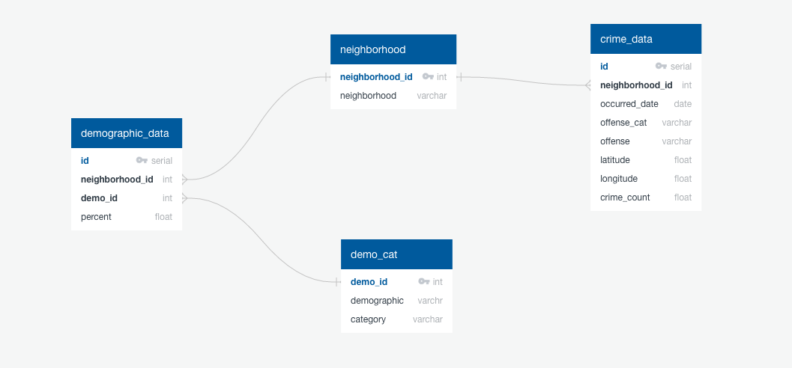

# Minneapolis_Neighborhood_Crime_Dashboard

### Produced by:
* Brandon Groenewold
* Nathan Johnson
* Kim Price
* Marti Reisinger

# Overview:
This code base gathers datasets to create a dashboard for Minneapolis neighborhoods focusing on crime starting in January, 2018 through August, 2022.  Demographic data (education level, income level, and population age) from the last census (2020) on each neighborhood will be used to round out the picture of the neighborhood and offer some points for discussion/analysis of possible correlations.

## Data Sets:

 * Minneapolis Neighborhood Crime: crime_data.csv
	* Link: https://www.minneapolismn.gov/government/government-data/datasource/crime-dashboard/
	* Description: Contains crime statistics for Minneapolis neighborhoods from 1/2018 through 8/2022.  Columns we will use are neighborhood, occurred date, offense category, offense, latitude, longitude, crime_count 

* Neighborhood Demographic data: ~5 bytes per file (85 files per demographic - age, education, income)
	* Link: https://data.worldbank.org/indicator/SP.POP.TOTL
	* Description: This source contains one csv per neighborhood, per demographic area. We are targeting age, income and education for all Minneapolis neighborhoods.
	
* Minneapolis Neighborhood GeoJson
	* Link:  https://github.com/blackmad/neighborhoods/blob/master/minneapolis.geojson
	* Description: GeoJson file containing the mapping of the neighborhoods in Minneapolis.

This project uses PostgreSQL.

# Instructions to recreate the database

 1. Clone the Repo git@github.com:kimaprice/Minneapolis_Neighborhood_Crime_Dashboard.git
 1. Open pgAdmin PostgreSQL
 1. Create a new database named ``minne_crime_db``.
 1. Open the ``minne_crime_db_Create.sql`` file in a query tool and run it to create the tables.
 1. Run ``jupyter notebook`` and open ``minne_crime_ETL.ipynb`` - run this in an environment that has pandas, sqlalchemy, numpy, and python 3.8
 1. Verify and update as needed the `username` `port` and `password` in the `LOAD` section of the notebook to match your PostgreSQL.
 1. Run the notebook.
 1. Use this test query to validate you successfully loaded the data.
 
Schema for database:

